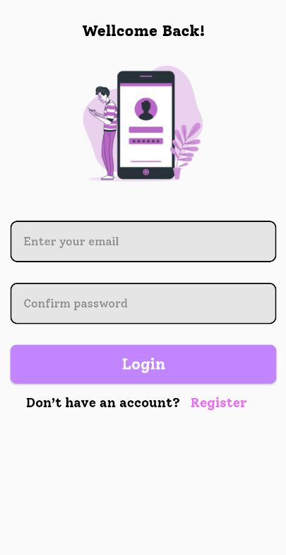

## **Mô tả sơ lược về ứng dụng**
* Nhằm giúp đỡ cho việc quản lý công việc hiểu quả. Ứng dụng được tạo được tạo ra để giải quyết vấn đề nêu trên.
* ứng dụng gồm các chức năng cơ bản như:
    * Đăng ký sử dụng Google Firebase Authencation.
    * Đăng nhập sử dụng Google Firebase Authencation.
    * Tạo được danh sách công việc cho bản thân(CRUD).
    * Từ danh sách công việc trên có thể tạo danh sách chi tiết công việc cho mỗi công việc(CRUD).
    * Đồng bộ danh sách công việc theo người dùng từ sqlLite lên Firebase Realtime và ngược lại(Phải đồng bộ được danh sách người dùng về máy để khi người dùng đăng nhập dựa vào id để lấy dữ liệu danh sách công việc về).

## **Một số hình ảnh của ứng dụng**
<p align="center">
  
</p>
<p align="center">
  1. Màn hình bắt đầu
</p>

<p align="center">
  
</p>
<p align="center">
  2. Màn hình đăng nhập
</p>

<p align="center">
  
</p>
<p align="center">
  3. Màn hình đăng ký
</p>

<p align="center">
  
</p>
<p align="center">
 4. Màn hình danh sách công việc
</p>

<p align="center">
  
</p>
<p align="center">
5. Màn hình danh sách chi tiết của một công việc
</p>

## **Cách tạo thông báo cho ứng dụng**
* Sử dụng một đối tượng Message để nhận hiển thị thông báo và xác nhận thông báo thông qua interface.
* **Code:**
```Java
  public interface MessageBoxListener {
      void result(int result);
  }


  public class Message {

    //show modal message in app
    public static void showMessage(Context context, String title, String message) {
        AlertDialog alertDialog = new AlertDialog.Builder(context)
                .setTitle(title)
                .setMessage(message).show();
    }

    //show modal confirm message in app - send data from interface
    // 1 -> true, 0 -> false
    // context get result and handle
    public static void  showConfirmMessgae(Context context, String title, String message, final MessageBoxListener listener ) {
        AlertDialog alertDialog = new AlertDialog.Builder(context)
                .setTitle(title)
                .setMessage(message)
                .setPositiveButton("Yes", new DialogInterface.OnClickListener() {
                    @Override
                    public void onClick(DialogInterface dialogInterface, int i) {
                        listener.result(1);
                    }
                }).setNegativeButton("No", new DialogInterface.OnClickListener() {
                    @Override
                    public void onClick(DialogInterface dialogInterface, int i) {
                        listener.result(0);
                    }
                }).show();
    }
}
```
* **Hình ảnh thông báo:**

  * Hiển thị thông báo:
<p align="center">
  
</p>

  * Hiển thị thông báo xác nhận:
  <p align="center">
  
</p>


## **Lấy data từ firebase:**
* Lấy tất cả user từ firebase về đồng bộ trong sql Lite bằng Room database:
  * Code:
  ```Java
       //init app no user then get data user - main - login
        if(userDAO.getAll().isEmpty()) {
            getDataUserFromFirebaseSaveToRoomDatabase();
        }

        private void getDataUserFromFirebaseSaveToRoomDatabase() {
        DatabaseReference mDatabase = FirebaseDatabase.getInstance().getReference();

        mDatabase.child("users").addValueEventListener(new ValueEventListener() {
            @Override
            public void onDataChange(@NonNull DataSnapshot snapshot) {
                for (DataSnapshot sn : snapshot.getChildren()) {
                    User user = sn.getValue(User.class);
                    try{
                        userDAO.insert(user);
                    }catch (Exception e) {
                        Log.e("ERROR:", "INSERT FAIL");
                        e.printStackTrace();
                    }
                }
            }

            @Override
            public void onCancelled(@NonNull DatabaseError error) {
                Log.w(TAG, "loadPost:onCancelled", error.toException());
            }
        });
    }
        //register
        private void saveDataFromClientToFireBase() {
        List<User> users = userDAO.getAll();
        Map<String, User> mapUsers = new HashMap<>();
        mDatabase = FirebaseDatabase.getInstance().getReference();

        for (User u : users) {
            mapUsers.put(u.getId() + "", u);
        }

        try {
            mDatabase.child("users").setValue(mapUsers);
        } catch (Exception e) {
            e.printStackTrace();
        }
    }
  ```
* Lấy task-list theo userId về đồng bộ trong sql Lite bằng Room database và ngược lại.

* Lấy task-list-detail theo taskId về đồng bộ trong sql Lite bằng Room database và ngược lại.